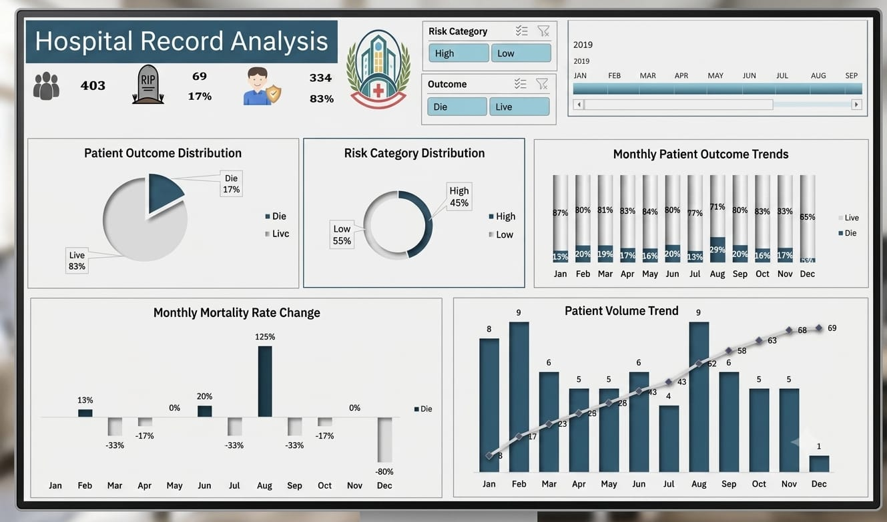

# Hospital Records Analysis

Analysis of hospital patient records to identify mortality trends and support clinical and staffing decisions.

**Tools:** Excel · Power Query · PivotTables · Data Visualization  
**Period:** 2019 (12 months)

## Objective
Analyze hospital patient records to understand mortality patterns and risk factors, in order to support staffing planning and clinical protocol improvements.

## Process
- Cleaned and transformed 403 real patient records using Power Query
- Built KPIs comparing mortality rates across risk categories using PivotTables
- Designed a dashboard to visualize mortality trends across the 12-month period

## Key Insights
- Overall die rate was **17.1%** across the year
- **High-Risk** patients showed a mortality rate of **21.4%**, compared to **13.6%** for Low-Risk patients
- **August** was the peak mortality month, with a die rate of **29%** — nearly double the annual average
- **December** showed significant improvement, with die rate dropping to **5%**, indicating a positive trend
- Delivered 4 actionable insights with staffing and protocol recommendations

## Dashboard Preview

## Files
| File | Description |
|---|---|
| `data_hospital_records_raw.xlsx` | Raw patient records data |
| `analysis_hospital_records_dashboard.xlsx` | Full analysis (Power Query + PivotTables + Dashboard) |
| `images_dashboard_hospital.jpeg` | Dashboard screenshot |

## Contact
[LinkedIn](https://www.linkedin.com/in/fares-ayman-483016257?utm_source=share_via&utm_content=profile&utm_medium=member_android)ا)
